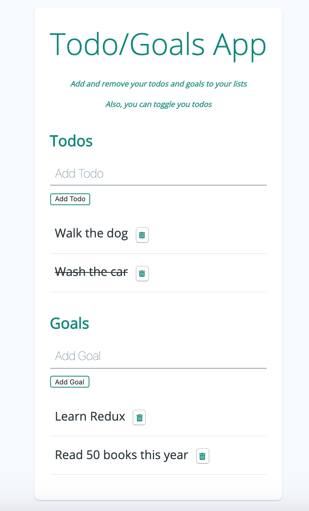

# redux-todo-goals-app
Todo/Goals application made with 💜  and Redux 🏆 

> Release v1.0.0. Sept' 2020 💪
> Release v1.0.1. Sept' 2020 💪 (deploy a React app in GitHub pages)

## What is it and what can I do with it?
Its name doesn't lie! This app is meant to keep your todos and goals in a cute list with which you can interact.
Once running in your localhost, you can:
- ➕ Add a todo or a goal to an individual list
- 🚫 Remove the selected todo or goal
- ✅ Toggle a todo (only) in case you want to make it available again, instead of removing it

<p align="center">
  
</p>

> As this app is open source and has a Affero AGPL license, you can fork it, change it, style it 💅, etc

## How to use it?
### ⚡️ Live
[Click and see!](https://kooltheba.github.io/redux-todo-goals-app/)

### ✨ Quick start

1.  **Clone this repository.**

    ```sh
    git clone https://github.com/KoolTheba/redux-todo-goals-app.git
    ```

2.  **Start developing.**

    Navigate into your new site’s directory and start it up.

    ```sh
    cd my-todo-goals-app/
    npm install
    npm run start
    ```

3.  **Running!**

    Your site is now running at `http://localhost:3000` 🚀

## Dependencies
- Redux
- Font-awesome

### Dev-dependencies
- gh-pages

## Acknowledgement 😻
Thanks a lot for the styling 💅 inspiration to [@YuneVK](https://github.com/YuneVK) and thank you for the Redux course to [@tylermcginnis](https://github.com/tylermcginnis)


